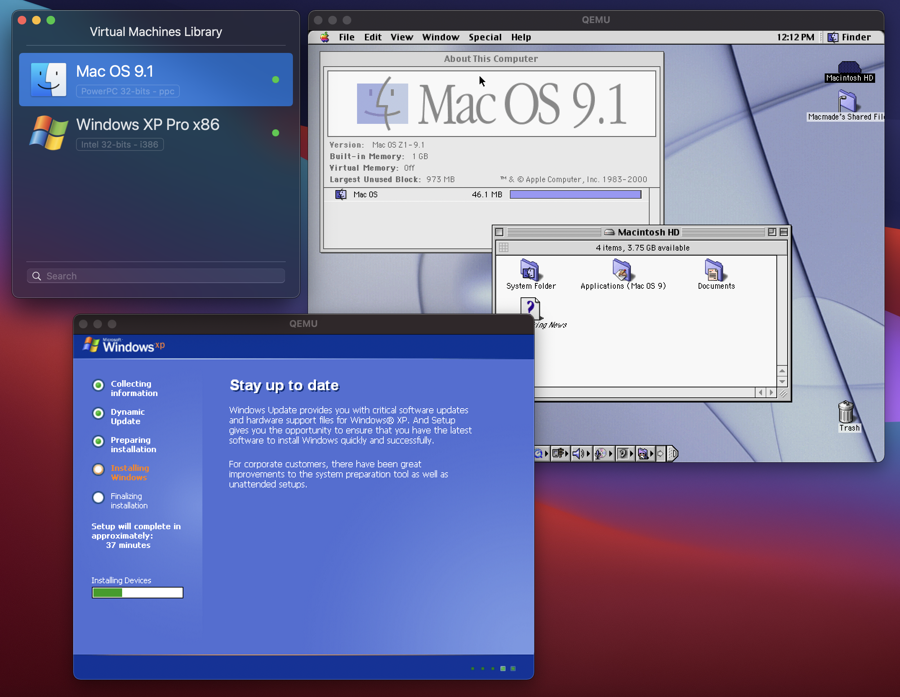
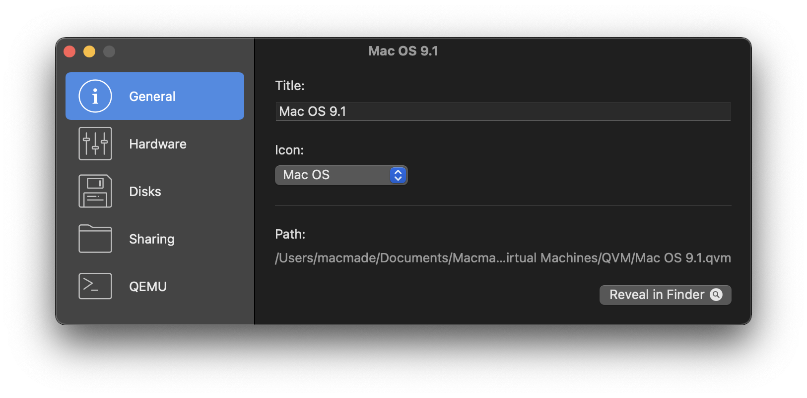
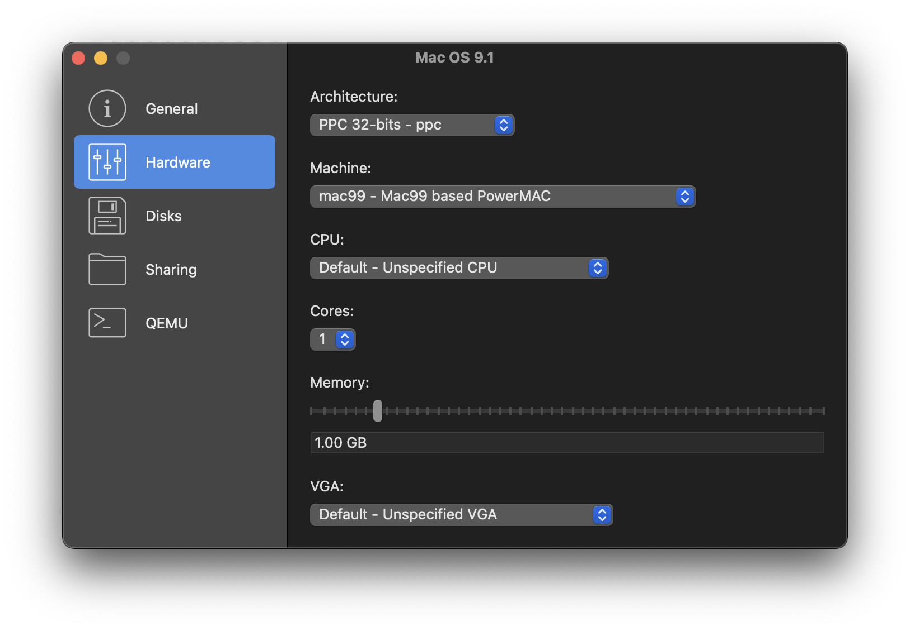
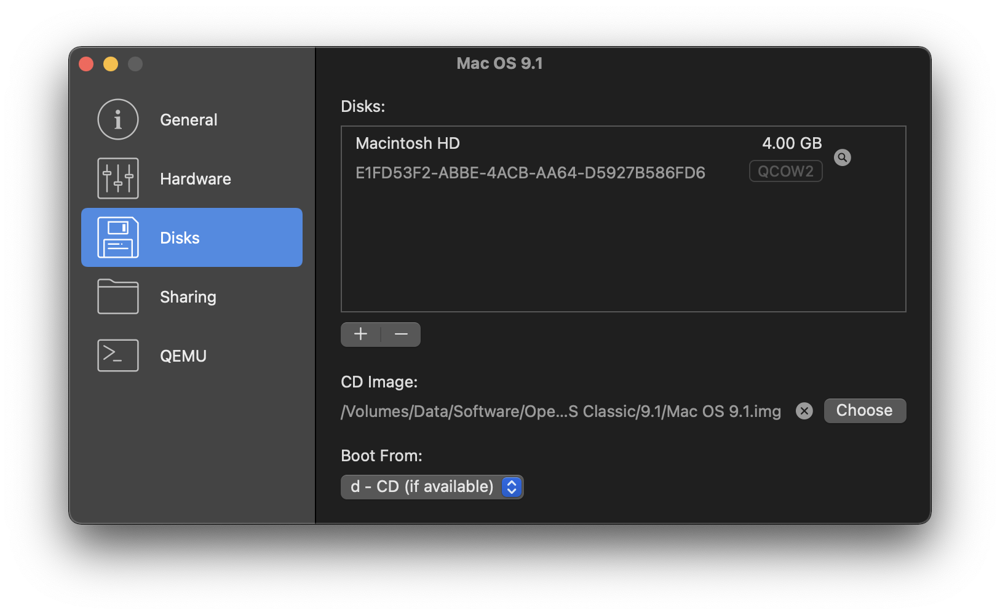
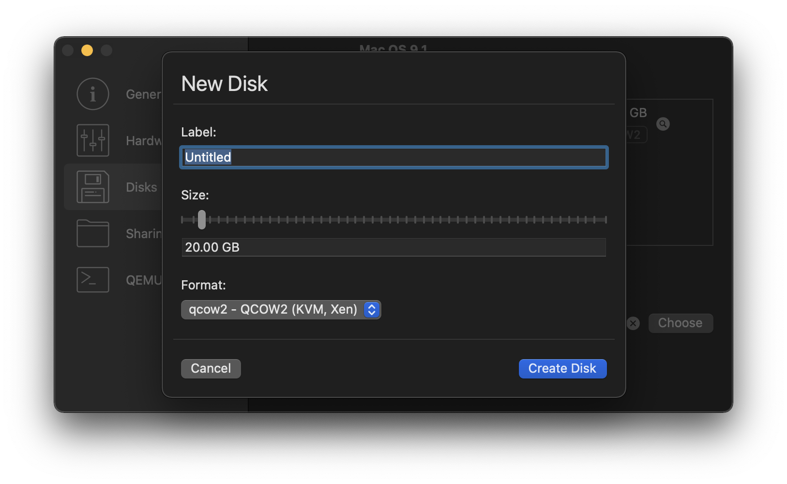
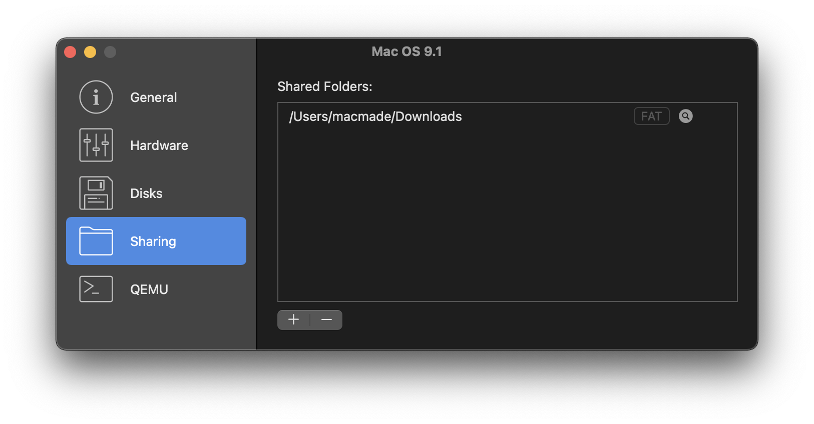
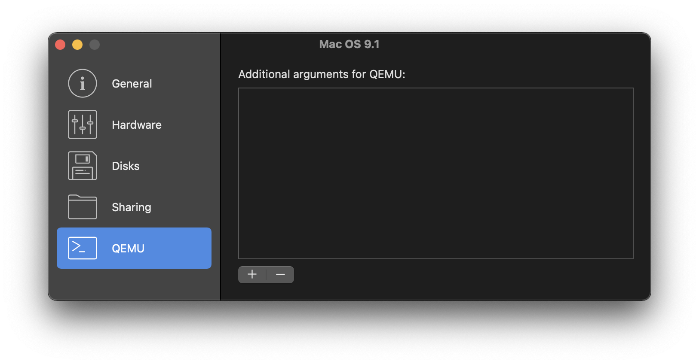

QEMU-Manager
============

  

### About

QEMU-Manager is a macOS graphical frontend to [QEMU](https://www.qemu.org), written in Swift.

### Screenshots

General Configuration:

Hardware Configuration:

Disks Configuration:

Sharing Configuration:

QEMU Configuration:

License
-------

Project is released under the terms of the GNU General Public License.

Repository Infos
----------------

    Owner:          Jean-David Gadina - XS-Labs
    Web:            www.xs-labs.com
    Blog:           www.noxeos.com
    Twitter:        @macmade
    GitHub:         github.com/macmade
    LinkedIn:       ch.linkedin.com/in/macmade/
    StackOverflow:  stackoverflow.com/users/182676/macmade
